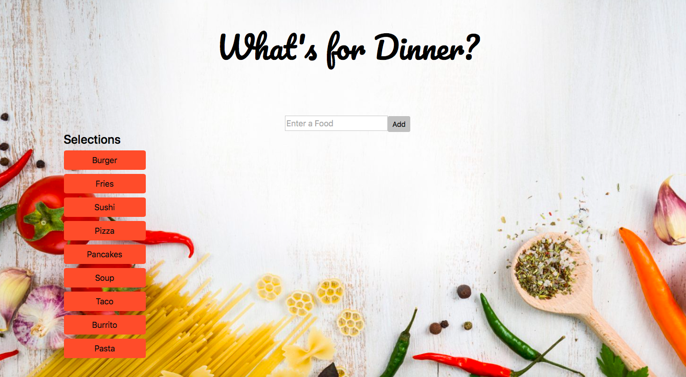

# gif-homework

## Description
A Web based Gif fetching application that uses the GIPHY API to fetch users' choice of GIFs. The user also has the option to add a new button of their favorite food to be added to the top array of food and those GIFs will be generated at the bottom. Each GIF has to be clicked to play/stop.

## Image Demo
#### Home Screen

#### Burrito Gif

#### Add New Gif Button 

